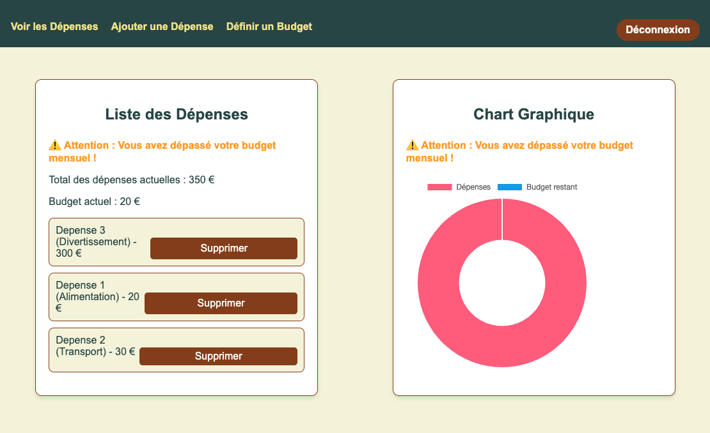

---

## **ExpenseTracker **



### **Description**

ExpenseTracker is an Angular-based frontend application for managing personal expenses. It provides a simple and intuitive user interface for tracking expenses, setting budgets, and monitoring budget overruns.

---

### **Features**

- **Expense Management:**
  - Add, view, and delete expenses.
  - Categorize expenses (e.g., Transport, Food, Entertainment).

- **Budget Management:**
  - Set a monthly budget.
  - Visualize budget overruns.

- **Authentication:**
  - Uses Firebase Authentication for user management.

---

### **Prerequisites**

- **Node.js** (version 16 or later)
- **Angular CLI**
- A valid Firebase configuration.

---

### **Installation and Configuration**

1. Clone the project:
   ```bash
   git clone https://github.com/your-repo/expense-tracker-frontend.git
   cd expense-tracker-frontend
   ```

2. Install dependencies:
   ```bash
   npm install
   ```

3. Configure Firebase:
   - Add your Firebase keys to the file `src/environments/environment.ts`:
     ```typescript
     export const environment = {
       production: false,
       firebase: {
         apiKey: "YOUR_API_KEY",
         authDomain: "YOUR_AUTH_DOMAIN",
         projectId: "YOUR_PROJECT_ID",
         storageBucket: "YOUR_STORAGE_BUCKET",
         messagingSenderId: "YOUR_MESSAGING_SENDER_ID",
         appId: "YOUR_APP_ID"
       }
     };
     ```

4. Run the application:
   ```bash
   ng serve
   ```

5. The application will be available at:
   ```bash
   http://localhost:4200
   ```

---

### **Technologies Used**

- **Framework:** Angular
- **Language:** TypeScript
- **Database:** Firestore (via the backend API)
- **Authentication:** Firebase Authentication

---


### **License**

This project is licensed under the MIT License. You are free to modify and redistribute it under the terms of this license.